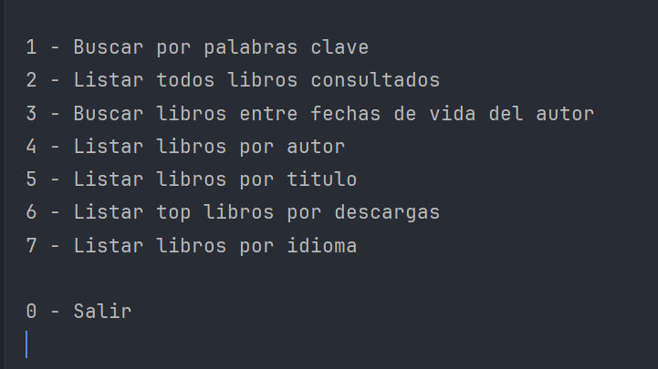
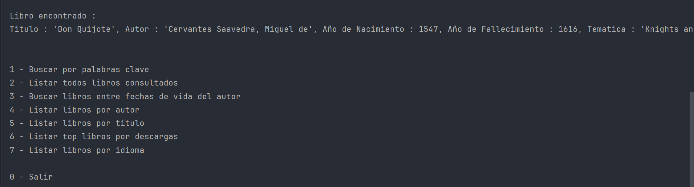
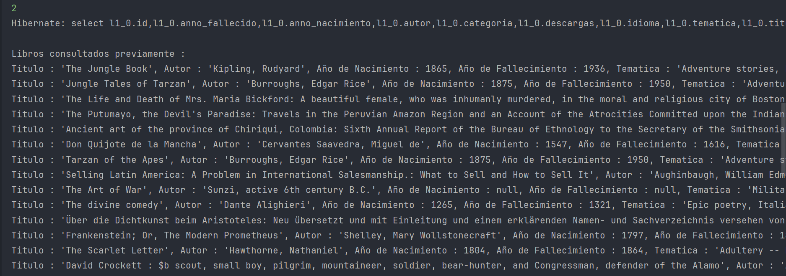
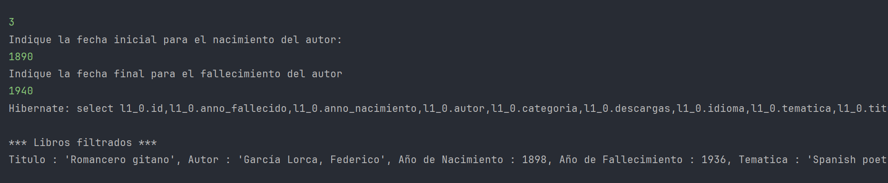
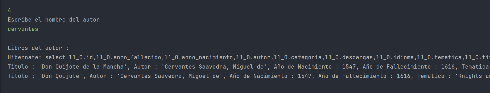
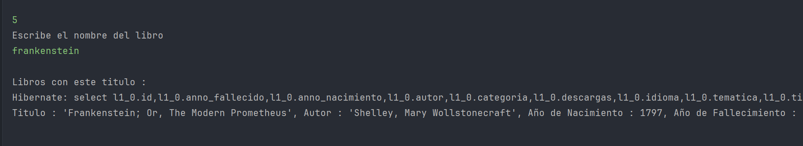
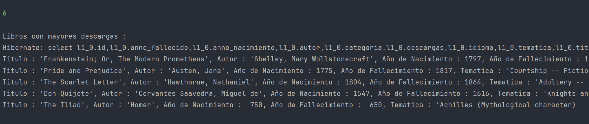
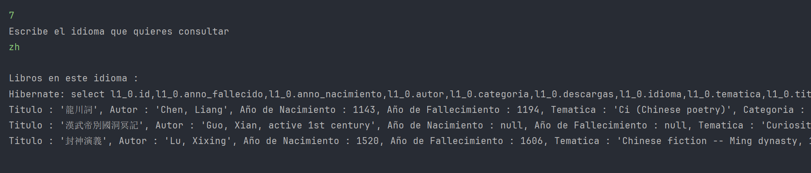
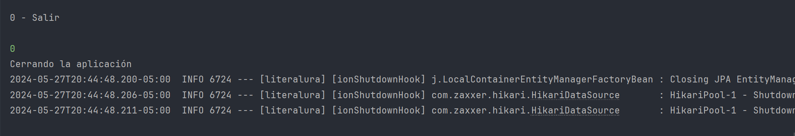

<h1 align="center">Challenge LiterAlura</h1>

    

        
        
        
        
        
    

<h3>Índice</h3>

- [Descripción del proyecto](#descripción-del-proyecto)

- [Estado del proyecto](#estado-del-proyecto)

- [Características de la aplicación y demostración](#caracteristicas)

- [Tecnologías utilizadas](#tecnologías-utilizadas)

<h2 id="descripción-del-proyecto">Descripción del proyecto</h2>

Este proyecto fue creado como propuesta de solución al challenge LiterAlura del programa de formación ONE de Oracle y Alura Latam. El proyecto consiste en una aplicación java backend, que se ejecuta en consola y permite consultar datos de libros en la API Gutendex, para ser almacenados en una base de datos PostgreSQL.

<h2 id="estado-del-proyecto">Estado del proyecto</h2>

La primera versión del proyecto se encuentra terminada y permite realizar consultas a la API y almacenar en base de datos.

<h2 id="caracteristicas">Características de la aplicación y demostración</h2>

- `Configuración inicial` : Se le solicita al usuario ingresar una de las opciones dispuestas.
  

- `Menú de opciones` :

- `[1] Buscar por palabras clave` : El usuario puede ingresar palabras clave, como el nombre del libro o el autor. La aplicación retorna la coincidencia aproximada según la solicitud.
  

- `[2] Listar todos los libros consultados` : Consulta la base de datos y retorna el histórico.
  

- `[3] Buscar libros entre fechas de vida del autor` : Muestra los libros, consultando la base de datos según los años en que el autor vivió.
  

- `[4] Listar libros por autor` : Retorna todas las coincidencias de los libros de un mismo autor.
  

- `[5] Listar libros por título` : Retorna todas las coincidencias de los libros según título.
    

- `[6] Listar top libros por descargas` : Ejecuta una consulta a la base de datos ordenando de mayor a menor descargas, y retonando solo los primeros 5.
  

- `[7] Listar libros por idioma` : Retorna todas las coincidencias de los libros por idioma.
  

- `[0] Salir` :Termina la ejecución de la aplicación.
  

<h2 id="tecnologías-utilizadas">Tecnologías utilizadas</h2>

La aplicación fue desarrollada usando JAVA, implementando clases, objetos, interfaces, consumo de API, Hibernate y JPA.
